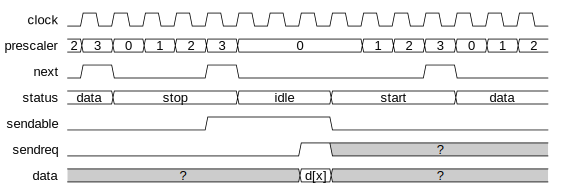

UARTモジュール
==============

## 送信

* 送信データの受付が可能な時、`sendable`出力を1にする
* 送信要求時、`sendreq`入力を1にする

* 次のビットに進む時、`next`フラグを1にする
* 最終ビット(ストップビット)時、`next`フラグとともに`sendable`出力を1にする

最終ビットの完了時、`sendreq`入力が1であれば、次のビットの送信に移る

最終ビットの完了時、`sendreq`入力が0であれば、idle状態に移行する

